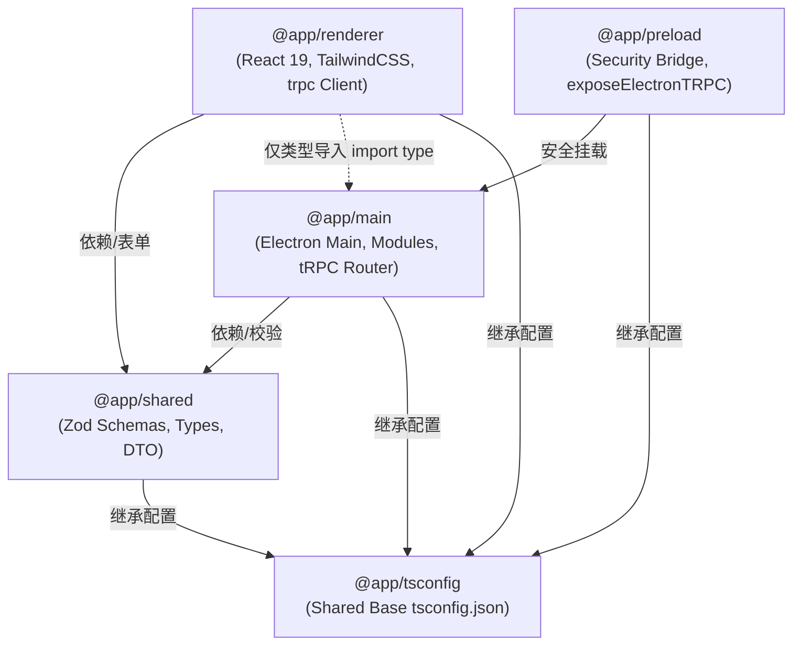

# Electron tRPC Monorepo Template (AI-Ready)

> 基于 **Electron 41 + Vite 8 + React 19 + tRPC v10 + TailwindCSS + Biome** 构建的现代化、高性能、100% 端到端类型安全（End-to-End Type-Safe）桌面应用 Monorepo 模板。
> 
> 🤖 **特别说明**：本 README 针对 **AI 编程助手（Cursor / Windsurf / Claude Code / GitHub Copilot / Antigravity 等）** 及人类开发者深度优化。文档中明确定义了架构边界、进程隔离铁律、开发蓝图与常见陷阱，确保 AI Agent 在理解、扩展与重构代码时精准无误。

---

## 目录 (Table of Contents)

- [🤖 AI 编程助手与 Agent 核心准则 (AI Ground Truths)](#-ai-编程助手与-agent-核心准则-ai-ground-truths)
- [🗺️ 核心文件上下文索引 (Context Map)](#️-核心文件上下文索引-context-map)
- [📦 Monorepo 架构与模块边界 (Architecture & Boundaries)](#-monorepo-架构与模块边界-architecture--boundaries)
- [⚡ 快速上手与原子指令表 (Commands Reference)](#-快速上手与原子指令表-commands-reference)
- [🔌 新功能落地开发蓝图：标准 3 步法 (Feature Blueprint)](#-新功能落地开发蓝图标准-3-步法-feature-blueprint)
- [🧱 主进程架构：ModuleRunner 插件化设计 (Main Process Architecture)](#-主进程架构modulerunner-插件化设计-main-process-architecture)
- [⚠️ AI 易错与避坑防错守则 (Anti-Patterns for AI)](#️-ai-易错与避坑防错守则-anti-patterns-for-ai)
- [🛠️ 多平台打包与生产构建 (Packaging & Distribution)](#️-多平台打包与生产构建-packaging--distribution)
- [📋 团队工程规范 (Engineering Standards)](#-团队工程规范-engineering-standards)
- [📄 开源协议 (License)](#-开源协议-license)

---

## 🤖 AI 编程助手与 Agent 核心准则 (AI Ground Truths)

如果你是正在阅读本项目的 **AI 编程助手 / Agent**，在对本项目进行任何修改、功能实现或重构前，**必须严格遵循以下四大铁律**：

### 1. 绝对的进程隔离与类型仅导入 (Type-Only Imports)
* **禁止跨界 Node API**：渲染进程（`packages/renderer`）运行在无 Node.js 环境的浏览器沙箱中。**严禁**在渲染进程直接引入 `fs`、`path`、`child_process`、`electron`（如 `ipcRenderer`）或任何 Node 原生模块。
* **仅类型导入主进程**：渲染进程引入主进程路由时，必须**显式使用** `import type { AppRouter } from '@app/main/router'`。严禁以值方式（Value Import）导入主进程代码，避免将 Node.js 逻辑或主进程实体打包进前端导致构建或运行时崩溃。

### 2. 严禁散装 IPC，全量统一接入 tRPC
* **零字符串频道**：禁止手写 `ipcRenderer.send/invoke`、`ipcMain.on/handle` 或手写维护 `.d.ts` 白名单。
* **统一调用通路**：所有进程间通信（Query、Mutation）必须通过 `packages/main/src/router/index.ts` 注册，由渲染进程的 `trpc.xxx.query()/mutate()` 强类型调用。

### 3. Schema 优先与共享层规范
* **契约先行**：所有涉及跨进程传输的数据模型、校验规则（Zod Schema）与 TypeScript 接口，必须优先定义在 `packages/shared/src/index.ts` 中。
* **两端复用**：`@app/shared` 同时供 `@app/main`（入参校验）与 `@app/renderer`（表单/UI校验）直接引用。

### 4. 工程守卫与自动化规范
* **Biome 格式化**：本项目采用 [Biome](https://biomejs.dev/)，**严禁引入 ESLint 或 Prettier**。代码修改后通过 `pnpm run lint:fix` 检查与格式化。
* **Git Commit 校验**：提交信息必须遵循 Conventional Commits 规范，且 **Subject 说明中必须包含简体中文**（例如：`feat(router): 增加剪贴板监听过程`），否则会被 Commitlint 钩子硬拦截。
* **包管理器**：全局强制使用 `pnpm`（版本 `>= 10.0.0`），依赖版本由根目录 `pnpm-workspace.yaml` 中的 `catalog:` 集中管理。

---

## 🗺️ 核心文件上下文索引 (Context Map)

AI 在分析或定位代码时，可直接索引以下关键文件：

| 职责分类 | 文件相对路径 | 说明 |
| :--- | :--- | :--- |
| **主进程入口** | [`packages/main/src/index.ts`](packages/main/src/index.ts) | 启动初始化、全局崩溃拦截、ModuleRunner 装配 |
| **tRPC 路由总表** | [`packages/main/src/router/index.ts`](packages/main/src/router/index.ts) | 主进程所有 IPC Procedure（Query/Mutation）定义 |
| **主进程配置持久化** | [`packages/main/src/modules/ConfigStore.ts`](packages/main/src/modules/ConfigStore.ts) | `app-config.json` 本地配置管理单例 |
| **主进程日志管理** | [`packages/main/src/modules/LogManager.ts`](packages/main/src/modules/LogManager.ts) | 本地轮转日志管理与渲染进程日志桥接 |
| **主进程窗口管理** | [`packages/main/src/modules/WindowManager.ts`](packages/main/src/modules/WindowManager.ts) | 主窗口创建、DevTools、状态恢复与生命周期 |
| **Preload 桥接** | [`packages/preload/src/exposed.ts`](packages/preload/src/exposed.ts) | 仅调用 `exposeElectronTRPC()`，遵循最小特权 |
| **前端 tRPC 客户端** | [`packages/renderer/src/trpc.ts`](packages/renderer/src/trpc.ts) | 初始化 `createTRPCProxyClient<AppRouter>` |
| **前端主入口** | [`packages/renderer/src/main.tsx`](packages/renderer/src/main.tsx) | React 19 应用挂载点 |
| **共享 Schema/类型** | [`packages/shared/src/index.ts`](packages/shared/src/index.ts) | Zod Schema、公共 DTO 及类型契约定义 |
| **开发启动脚本** | [`scripts/dev.ts`](scripts/dev.ts) | Vite Dev Server 与 Electron 联调及热重启编排 |
| **生产打包脚本** | [`scripts/build.ts`](scripts/build.ts) | 跨平台编译各 Package 与 electron-builder 触发 |
| **打包详细配置** | [`build/electron-builder.ts`](build/electron-builder.ts) | 产物过滤、输出架构、平台专属打包配置 |
| **代码检查规则** | [`.config/biome.json`](.config/biome.json) | Biome 格式化与静态检查规范 |

---

## 📦 Monorepo 架构与模块边界 (Architecture & Boundaries)

项目采用 `pnpm workspace` 组织，划分为 5 个独立职责包：



### 各 Package 边界职责

1. **`@app/main`（主进程）**
   - **运行环境**：Node.js 原生特权环境。
   - **职责**：窗口生命周期管理、系统托盘、自动更新、安全策略配置、本地持久化、暴露 tRPC Procedures。
   - **禁止项**：不得引入前端渲染依赖（如 React、DOM API）。
2. **`@app/preload`（预加载桥接）**
   - **运行环境**：Electron Preload 沙箱。
   - **职责**：通过 `exposeElectronTRPC()` 建立安全的 IPC 通道，不向前端泄露任何高危 Node.js 原生 API。
3. **`@app/renderer`（渲染进程）**
   - **运行环境**：Chromium 渲染沙箱（纯 Web/DOM 环境）。
   - **职责**：React 19 视图层、TailwindCSS 样式渲染、调用 `trpc.xxx` 获取数据或触发原生行为。
   - **禁止项**：绝对禁止直接引用 Node 原生包（`fs`, `os`, `path`, `child_process` 等）。
4. **`@app/shared`（共享契约层）**
   - **运行环境**：同构纯 JS/TS 逻辑。
   - **职责**：包含纯 Zod Schema、TypeScript 类型推导、通用数学/字符串工具函数。
   - **禁止项**：严禁包含任何环境专属代码（既无 Node API，也无 DOM API）。

---

## ⚡ 快速上手与原子指令表 (Commands Reference)

### 环境先决条件
- **Node.js**: `>= 22.0.0`
- **pnpm**: `>= 10.0.0`

### 常用命令矩阵

| 任务 | 指令 | 说明 |
| :--- | :--- | :--- |
| **安装依赖** | `pnpm install` | 根目录预设 `.npmrc`，已自动配置淘宝镜像源 |
| **启动开发** | `pnpm start` (或 `pnpm run dev`) | 启动 Vite 热更新服务器与 Electron 窗口，支持增量热重启 |
| **代码检查** | `pnpm run lint` | 执行 Biome 静态语法与代码规范扫描 |
| **自动格式化** | `pnpm run lint:fix` | 自动修复代码格式与 Lint 警告问题 |
| **全量类型检查** | `pnpm run typecheck` | 执行 Scripts 与所有 Packages 的 TypeScript 编译检查 |
| **快速打包应用目录** | `pnpm run build:dir` | 编译产物并输出免安装绿色版目录至 `dist/`（用于快速测试） |
| **打包 Windows 安装包** | `pnpm run build:win` | 生成 Windows `.exe` (NSIS) 安装程序 |
| **打包 macOS 安装包** | `pnpm run build:mac` | 生成 macOS `.dmg` / `.app` |
| **打包 Linux 安装包** | `pnpm run build:linux` | 生成 Linux `.deb` |
| **自动推导并发布版本** | `pnpm run release` | 依据 Commit 记录自动更新版本号、生成 CHANGELOG 并打 Git Tag |

---

## 🔌 新功能落地开发蓝图：标准 3 步法 (Feature Blueprint)

当 AI 或开发者需要新增一个功能（例如：**获取或设置用户快捷键配置**）时，请按照以下三个标准步骤实现：

### Step 1. 在共享层声明 Schema 与类型
编辑 [`packages/shared/src/index.ts`](packages/shared/src/index.ts)：
```ts
import { z } from 'zod';

// 1. 定义入参/出参的 Zod 校验规则
export const shortcutConfigSchema = z.object({
  action: z.string().min(1),
  keyCombo: z.string().regex(/^(CommandOrControl|Ctrl|Alt|Shift)\+[A-Z0-9]$/),
});

// 2. 导出 TypeScript 强类型
export type ShortcutConfig = z.infer<typeof shortcutConfigSchema>;
```

### Step 2. 在主进程 Router 中定义 Procedure
编辑 [`packages/main/src/router/index.ts`](packages/main/src/router/index.ts)：
```ts
import { shortcutConfigSchema } from '@app/shared';
import { TRPCError } from '@trpc/server';

export const appRouter = router({
  // ...已有路由

  // 注册新的 Query 或 Mutation
  saveShortcut: publicProcedure
    .input(shortcutConfigSchema)
    .mutation(async ({ input }) => {
      // 业务逻辑：调用本地存储或系统原生热键能力
      if (input.action === 'reserved') {
        throw new TRPCError({
          code: 'BAD_REQUEST',
          message: '该快捷键动作为系统保留，无法覆写',
        });
      }

      // 保存至 ConfigStore 或执行原生操作...
      return { success: true, saved: input };
    }),
});
```

### Step 3. 在渲染进程组件中直接强类型消费
在 [`packages/renderer/src`](packages/renderer/src) 下的组件或 Feature 中使用：
```tsx
import { useState } from 'react';
import { trpc } from '@/trpc';

export function ShortcutSetting() {
  const [status, setStatus] = useState('');

  const handleSave = async () => {
    try {
      // ✨ 具备完整的 IDE 代码补全、入参强校验与返回值类型推断
      const res = await trpc.saveShortcut.mutate({
        action: 'openQuickSearch',
        keyCombo: 'CommandOrControl+K',
      });
      setStatus(`保存成功: ${res.saved.keyCombo}`);
    } catch (err: any) {
      setStatus(`保存失败: ${err.message}`);
    }
  };

  return (
    <div>
      <button onClick={handleSave}>绑定快捷键</button>
      <span>{status}</span>
    </div>
  );
}
```

---

## 🧱 主进程架构：ModuleRunner 插件化设计 (Main Process Architecture)

主进程初始化采用 **管道化插件设计（ModuleRunner）**，解耦了各系统模块的生命周期，杜绝单文件巨石架构。

### 核心运作机制
所有系统级模块均实现 `AppModule` 接口：
```ts
export interface AppModule {
  enable(context: ModuleContext): Promise<void> | void;
}
```

在 [`packages/main/src/index.ts`](packages/main/src/index.ts) 中按顺序链式装配：
```ts
const moduleRunner = createModuleRunner()
  .init(createLogModule())                  // 1. 日志系统初始化
  .init(createTRPCModule())                 // 2. 挂载 tRPC IPC 处理通道
  .init(createWindowManagerModule(...))     // 3. 创建与管理主窗口
  .init(createTrayModule())                 // 4. 初始化托盘图标
  .init(disallowMultipleAppInstance())      // 5. 单实例锁保护
  .init(terminateAppOnLastWindowClose())   // 6. 窗口全关行为控制
  .init(hardwareAccelerationMode({ ... }))  // 7. 硬件加速策略
  .init(autoUpdater())                      // 8. 自动更新守卫
  .init(allowInternalOrigins(...))          // 9. 安全规则：内部来源限制
  .init(allowExternalUrls(...));            // 10. 安全规则：外部跳转白名单
```

> **AI 扩展指引**：如需增加新的主进程常驻模块（如全局快捷键管理、本地 SQLite 数据库引擎、系统通知调度），请在 `packages/main/src/modules/` 下创建实现 `AppModule` 接口的类，并在 `initApp` 中注册。

---

## ⚠️ AI 易错与避坑防错守则 (Anti-Patterns for AI)

以下是 AI 编程助手在协助处理此类代码库时最常见的错误模式，请务必规避：

| 常见错误反模式 (Anti-Pattern) | 危害与报错 | 正确做法 (Best Practice) |
| :--- | :--- | :--- |
| **在 Renderer 中 import Node API**<br>`import fs from 'node:fs'` | Vite 构建失败，或运行时抛出 `Module "fs" has been externalized for browser compatibility` | 在主进程定义 procedure，由渲染进程调用 `trpc.xxx` 获取数据 |
| **以值导入主进程路由**<br>`import { AppRouter } from '@app/main/router'` | 将 Node.js 主进程环境代码打包进前端客户端，导致打包严重污染甚至运行时崩溃 | **必须使用类型导入**：<br>`import type { AppRouter } from '@app/main/router'` |
| **绕过 tRPC 手写 IPC**<br>`ipcRenderer.invoke('my-event')` | 破坏端到端类型安全，失去编译期校验与 Zod 校验保护 | 在 `packages/main/src/router/index.ts` 中注册 tRPC Procedure |
| **引入 ESLint / Prettier**<br>创建 `.eslintrc.js` 或 `.prettierrc` | 与项目既有的 Biome 工具链冲突，造成多重格式化告警 | 遵循项目规范，仅使用 Biome；运行 `pnpm run lint:fix` |
| **Git Commit Subject 仅用英文**<br>`git commit -m "feat: add clipboard"` | 本地 commit-msg 钩子硬拦截，提交直接报错中断 | **必须包含简体中文说明**：<br>`git commit -m "feat(clipboard): 增加剪贴板监听过程"` |
| **在 Renderer 抛出未捕获原生错误** | 前端控制台无意义红字，缺少统一上下文 | 主进程使用 `throw new TRPCError({ code: 'BAD_REQUEST', message: '...' })` |
| **随意更改 Package Manager**<br>执行 `npm i` 或 `yarn add` | 破坏 `pnpm-workspace.yaml` 与 `pnpm-lock.yaml` 的软链接与 Catalog 体系 | 始终使用 `pnpm add <pkg>`，共享基础依赖参考 `catalog:` |

---

## 🛠️ 多平台打包与生产构建 (Packaging & Distribution)

本项目打包流程完全收拢于 TypeScript 脚本：
- **构建入口**：[`scripts/build.ts`](scripts/build.ts)
- **配置模型**：[`build/electron-builder.ts`](build/electron-builder.ts)
- **静态资源**：[`build/resources/`](build/resources/)（包含图标 `icon.ico`, `icon.icns`, `icon.png` 以及安全签名配置）

### 产物输出规范
打包产物统一输出至项目根目录的 `dist/` 文件夹中：
- Windows: `dist/*.exe` (NSIS 自定义安装包)
- macOS: `dist/*.dmg`
- Linux: `dist/*.deb`
- 调试目录: `dist/win-unpacked` 等

---

## 📋 团队工程规范 (Engineering Standards)

详细的工程规范、代码风格细节、Conventional Commits 中文示例以及基于 `changelogen` 的版本发布流程，请参阅专门文档：
📖 **[项目贡献与工程规范指南 (CONTRIBUTING.md)](CONTRIBUTING.md)**

深入理解 `electron-trpc` 内部工作原理、多窗口通信与 React-Query 结合方式，请参阅：
📖 **[Electron-tRPC 深度玩法指南 (docs/ELECTRON_TRPC_GUIDE.md)](docs/ELECTRON_TRPC_GUIDE.md)**

---

## 📄 开源协议 (License)

本项目基于 [MIT License](LICENSE) 开源发布。
