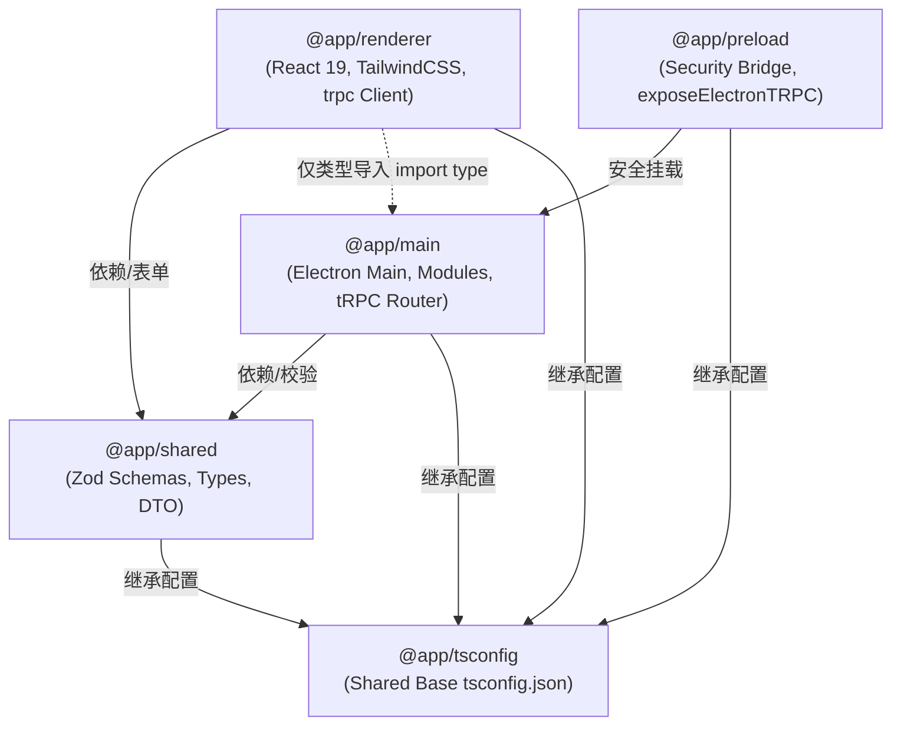

# Electron tRPC Monorepo Template

> 基于 **Electron 41 + Vite 8 + React 19 + tRPC v10 + TailwindCSS + Biome** 构建的现代化、高性能、100% 端到端类型安全（End-to-End Type-Safe）桌面应用 Monorepo 模板。

[](LICENSE)
[](https://nodejs.org/)
[](https://pnpm.io/)
[](https://biomejs.dev/)

---

## ✨ 核心特性

- 🔒 **100% 端到端类型安全**：借助 `electron-trpc`，主进程与渲染进程通信告别手写字符串频道和 `.d.ts`，调用与传参全程具备 IDE 强补全与类型检查。
- 📦 **现代 Monorepo 结构**：基于 `pnpm workspace` 与 Catalog 依赖管理，主进程、渲染进程、Preload 与共享契约层职责划分清晰严谨。
- ⚡ **极致极速构建流**：Vite 8 构建渲染层与主进程增量热重启编排，开发即时反馈。
- 🎨 **前沿技术栈选型**：React 19、TailwindCSS 快速 UI 搭建、[Biome](https://biomejs.dev/) 超高速代码检查与格式化（摒弃 ESLint + Prettier 冗杂配置）。
- 🧱 **ModuleRunner 插件化主进程**：主进程采用管道化模块生命周期设计，系统级功能解耦清晰，告别单文件巨石架构。
- 🤖 **AI-Ready 原生友好**：遵循开放标准，在根目录预置 [`AGENTS.md`](AGENTS.md)，使 Cursor、Claude Code、Windsurf、Antigravity 等 AI 编程助手能即时理解架构约束并杜绝幻觉。

---

## 📦 Monorepo 架构与模块边界

项目由 5 个职责明确的独立包组成：



### 包职责划分

| 包名 | 职责与环境 | 核心约束 |
| :--- | :--- | :--- |
| **`@app/main`** | 主进程（Node.js 特权环境）。窗口管理、系统托盘、自动更新、tRPC 路由服务。 | 严禁引入前端 DOM 相关逻辑。 |
| **`@app/preload`** | Preload 安全桥接层。通过 `exposeElectronTRPC()` 注入安全 IPC 通道。 | 最小特权原则，不泄露危险 Node API。 |
| **`@app/renderer`** | 渲染进程（Chromium 沙箱环境）。React 19 视图层、Tailwind 样式、tRPC 客户端。 | **绝对禁止**直接引入 Node 原生模块。 |
| **`@app/shared`** | 跨进程共享契约层（同构纯 JS/TS）。Zod 校验模型、公共 DTO 与通用工具函数。 | 无环境特化依赖（无 Node / DOM API）。 |
| **`@app/tsconfig`**| 基础 TypeScript 配置包，供各 Package 统一继承。 | 规范编译选项与类型严谨度。 |

---

## ⚡ 快速上手

### 环境准备
- **Node.js**: `>= 22.0.0`
- **pnpm**: `>= 10.0.0`

### 常用命令

```bash
# 1. 安装依赖（根目录预置 .npmrc 淘宝镜像配置）
pnpm install

# 2. 启动本地开发联调（支持 Vite 前端热更新与 Electron 增量重启）
pnpm start

# 3. 代码检查与自动化格式化（Biome）
pnpm run lint
pnpm run lint:fix

# 4. 全局 TypeScript 严格类型检查
pnpm run typecheck

# 5. 快速打包解压目录（用于本地快速测试）
pnpm run build:dir

# 6. 多平台正式发布打包
pnpm run build:win      # 生成 Windows 安装包 (.exe)
pnpm run build:mac      # 生成 macOS 安装包 (.dmg / .app)
pnpm run build:linux    # 生成 Linux 安装包 (.deb)
```

---

## 🧱 主进程架构：ModuleRunner 设计

主进程采用管道化插件模式（ModuleRunner）管理所有核心子系统生命周期，实现各模块即插即用：

```ts
// packages/main/src/index.ts
const moduleRunner = createModuleRunner()
  .init(createLogModule())                  // 日志系统初始化
  .init(createTRPCModule())                 // 挂载 tRPC IPC 通道
  .init(createWindowManagerModule(...))     // 主窗口创建与生命周期恢复
  .init(createTrayModule())                 // 系统托盘管理
  .init(disallowMultipleAppInstance())      // 单实例互斥锁
  .init(hardwareAccelerationMode({ ... }))  // 硬件加速配置
  .init(autoUpdater())                      // 自动更新检查
  .init(allowInternalOrigins(...))          // 安全规则拦截
  .init(allowExternalUrls(...));            // 外部安全跳转白名单
```

> 详细设计与自定义模块开发方法，请参阅架构白皮书：[ModuleRunner 架构详解 (docs/MODULE_RUNNER_ARCHITECTURE.md)](docs/MODULE_RUNNER_ARCHITECTURE.md)。

---

## 🛠️ 多平台打包与签名 (Packaging)

打包流程完全基于 TypeScript 编写并由 `electron-builder` 驱动：
- **构建入口**：[`scripts/build.ts`](scripts/build.ts)
- **配置模型**：[`build/electron-builder.ts`](build/electron-builder.ts)
- **静态资源**：[`build/resources/`](build/resources/)（多格式图标、NSIS 安装向导等）
- **产物输出目录**：根目录 `dist/`

有关 Windows 代码签名、自建受信任证书与 CI/CD 自动签名指南，请查阅：[代码签名与证书配置指引 (docs/CODE_SIGNING_GUIDE.md)](docs/CODE_SIGNING_GUIDE.md)。

---

## 📚 延伸指南与文档导航

- 🤖 **[AI 助手指令与避坑手册 (AGENTS.md)](AGENTS.md)**：专为 AI 编码代理（Cursor, Claude Code 等）制定的机器可读规范、上下文索引与 3 步落地开发蓝图。
- 🤝 **[贡献指南与工程规范 (CONTRIBUTING.md)](CONTRIBUTING.md)**：Git Commit 中文提交规范、Pull Request 流程与基于 `changelogen` 的自动版本发布。
- 🔌 **[Electron-tRPC 深度指南 (docs/ELECTRON_TRPC_GUIDE.md)](docs/ELECTRON_TRPC_GUIDE.md)**：端到端类型安全通信原理、多窗口通信与 React-Query 联动实践。
- 🧱 **[ModuleRunner 架构白皮书 (docs/MODULE_RUNNER_ARCHITECTURE.md)](docs/MODULE_RUNNER_ARCHITECTURE.md)**：深入理解主进程管道化插件设计与扩展。

---

## 📄 开源协议

本项目采用 [MIT 协议](LICENSE) 开源。
